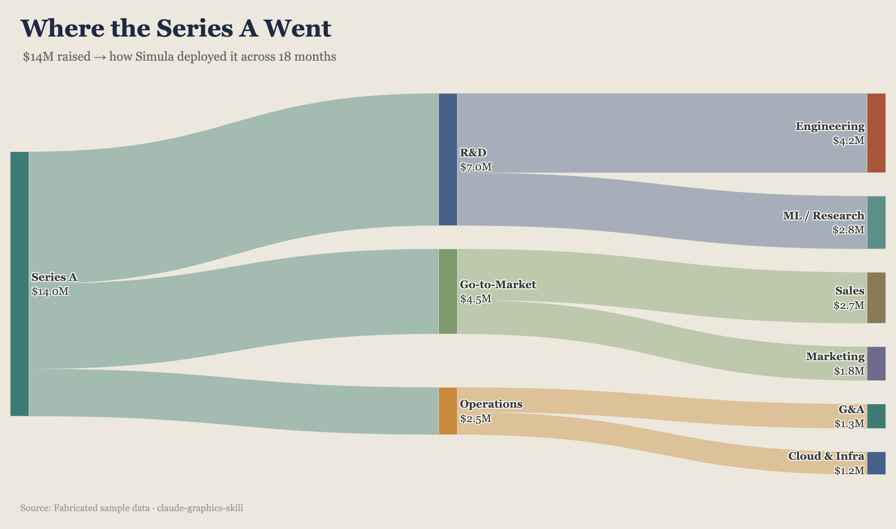
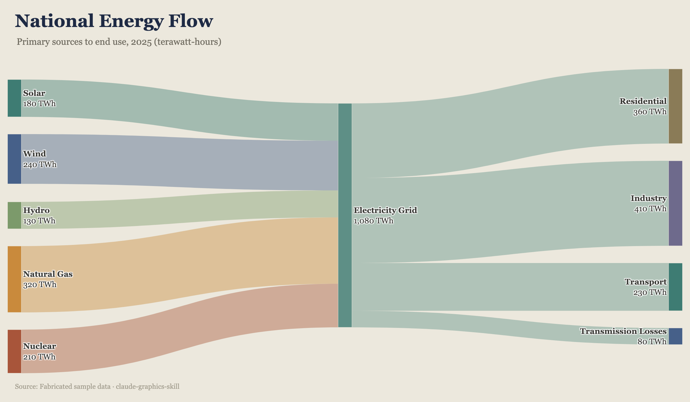
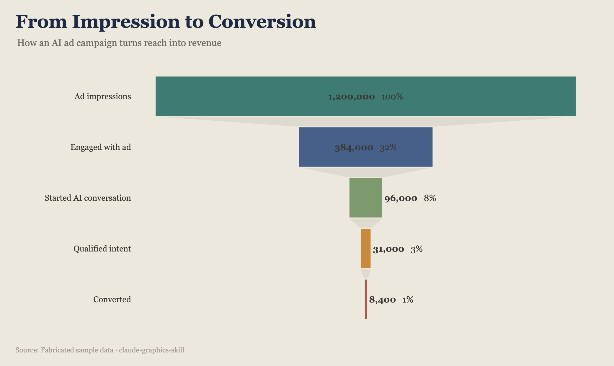
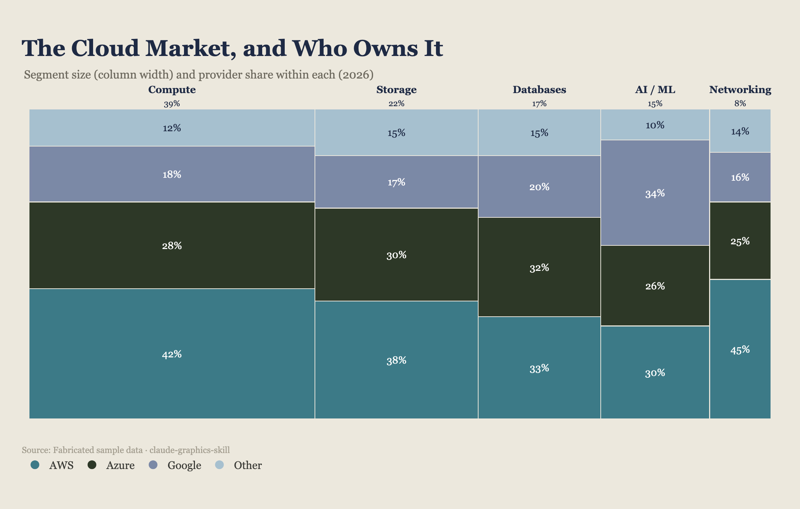
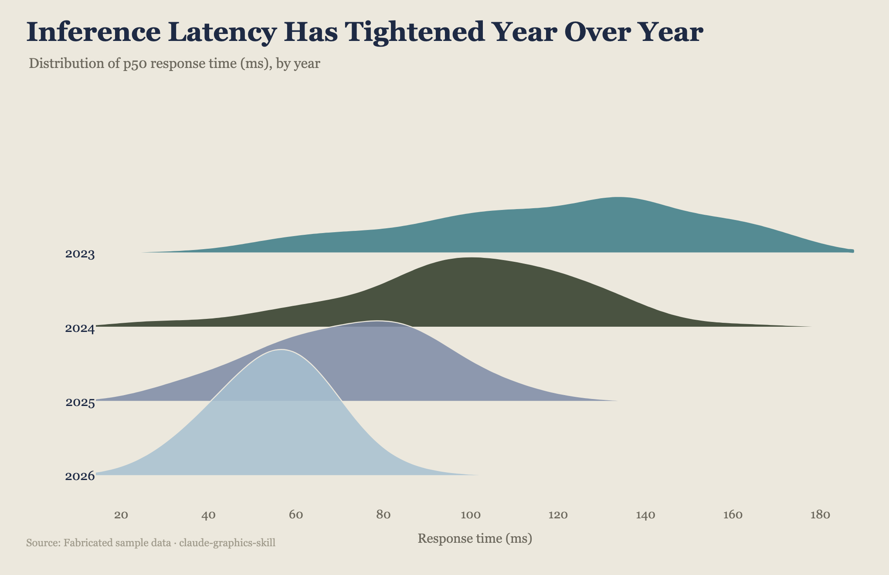
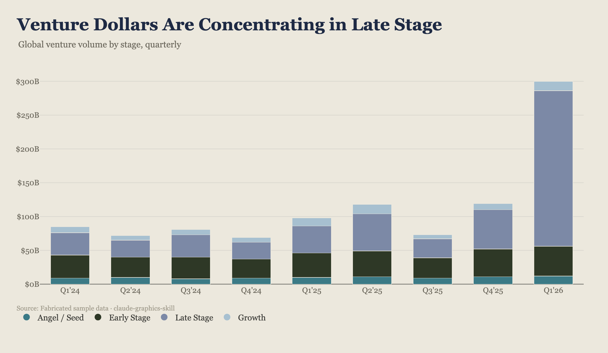
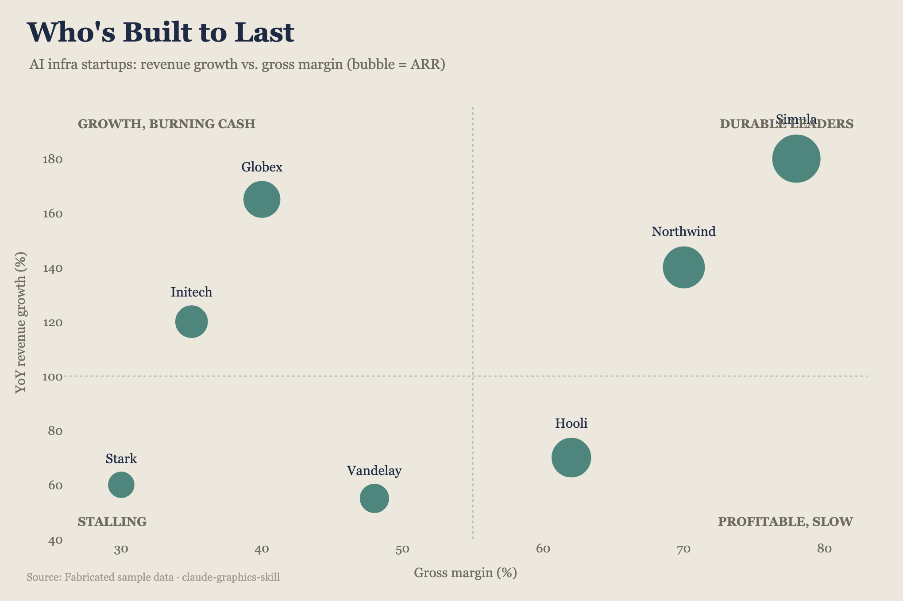
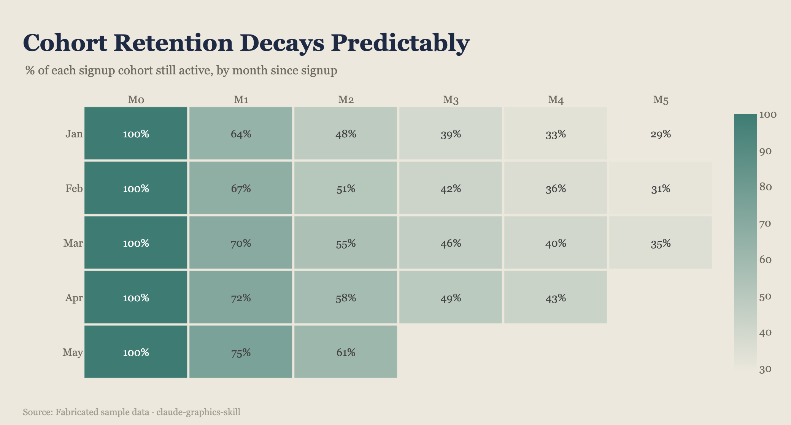

<div align="center">

# claude-graphics-skill

**Presentation-ready charts in an editorial house style — 30 types, designed defaults, PNG/SVG/HTML out.**

A Claude Skill (and CLI) that turns structured JSON into graphics that look like a studio spent hours on them: serif headlines, curated palettes, number-as-hero labels, header rule + footer wordmark.

</div>

## Gallery

Eight examples rendered from the specs in `examples/`:

<p align="center">
  
  
</p>
<p align="center">
  
  
</p>
<p align="center">
  
  
</p>
<p align="center">
  
  
</p>

Render the full contact sheet of every example:

```bash
./.venv/bin/python scripts/build_gallery.py   # → output/gallery.html + PNGs
```

## Quick start

```bash
python3 -m venv .venv
./.venv/bin/pip install -r requirements.txt

# Interactive HTML
./.venv/bin/python scripts/render.py examples/budget_flow.json
open output/budget_flow.html

# Static export for slides / LinkedIn
./.venv/bin/python scripts/render.py examples/energy_flow.json -f png
./.venv/bin/python scripts/render.py examples/energy_flow.json -f svg
```

## CLI

```
python scripts/render.py SPEC.json [options]

  -o, --out PATH        Output path (extension infers format if -f omitted)
  -f, --format FMT      html (default) | svg | png
  -t, --theme NAME      midnight (default) | simula | editorial | brand
  --png-scale N         PNG resolution multiplier (default 2 = retina)
```

**30 chart types:** `bar` (single/grouped/stacked/100%/diverging), `line`/`area`, `combo`, `scatter`/bubble/quadrant, `pie`/donut, `waterfall`, `dot` (lollipop/dumbbell), `heatmap`, `treemap`, `sunburst`, `small_multiples`, `histogram`, `box`/violin, `radar`, `slope`, `bump`, `candlestick`, `table`, `bignumber`, `gauge`, `bullet`, `sankey`, `funnel`, `marimekko`, `pyramid`, `choropleth`, `pictograph`, `beeswarm`, `stream`, `ridgeline`.

Full field specs: [`references/chart_types.md`](references/chart_types.md). Skill instructions for Claude: [`SKILL.md`](SKILL.md).

**Themes:** `midnight` (dark, high-impact), `simula` (dark brand), `editorial` (a16z / warm paper), `brand` (light indigo).

## Spec format (short)

| Field | What it is |
|---|---|
| `chart_type` | one of the 30 renderers |
| `title` / `subtitle` / `source` | headline, takeaway, attribution |
| `theme` | `editorial` \| `simula` \| `midnight` \| `brand` |
| `footer` / `wordmark` | optional brand strip |
| chart-specific data | e.g. `bars`, `nodes`/`links`, `stages` — see references |

56 ready-to-render examples live in `examples/`.

### Example asks for Claude

- *"Take this budget table and make a Sankey — dark theme, for LinkedIn."*
- *"10k signups → 6.2k activated → 2.6k paid. Diagram the funnel."*
- *"a16z-style bar chart of AI share of software spend; highlight 2026."*

## Architecture

Registry of chart modules under `scripts/charts/` — add a type by registering a Plotly renderer; themes and title/source furniture apply for free. See the previous README / `PROGRESS.md` for per-type fidelity notes.

```
scripts/render.py          # CLI dispatcher
scripts/charts/*.py        # one module per chart family
scripts/theme.py           # palettes + themes
examples/*.json            # 56 specs
docs/gallery/              # curated PNGs for this README
```

## License

See repository. Use the skill with Claude, or drive `scripts/render.py` directly.
